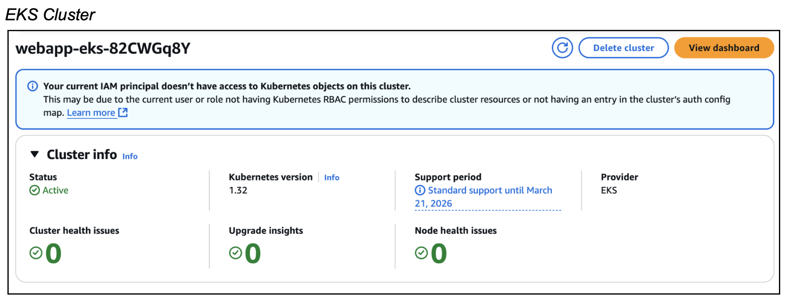
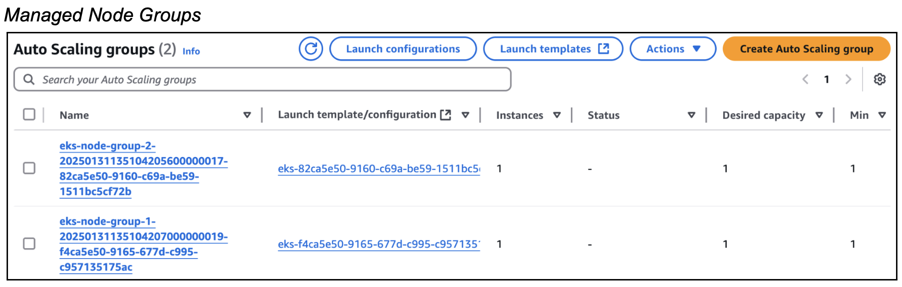
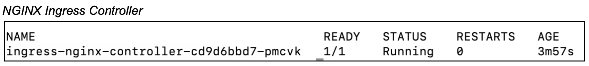

# Provision an EKS Cluster using Terraform

This repository contains Terraform configuration files to provision an EKS cluster on AWS. The setup includes deploying an NGINX Ingress Controller to manage external access to services running in the cluster.

*Note: AWS EKS clusters cost $0.10 per hour, which may lead to charges while running this setup. To avoid unnecessary costs, ensure you delete the infrastructure after use with `terraform destroy`. For more details on pricing, see: [AWS EKS Pricing](https://aws.amazon.com/eks/pricing/).*

## Overall Architecture

<p align="left">

</p>

- **EKS Cluster**: A scalable EKS cluster with managed node groups
- **NGINX Ingress Controller**: For routing external traffic to services within the cluster
- **VPC Setup**: Configured with private and public subnets to support cluster networking

## Prerequisites

- AWS CLI configured with appropriate credentials
- kubectl installed
- Terraform installed 

## Infrastructure Deployment

Deploy the infrastructure using the following commands:

```
# Initialize Terraform working directory
terraform init
# Preview the changes to be applied
terraform plan
# Apply the changes to create the infrastructure
terraform apply
```

Once the Terraform deployment is complete, the following information will be output:
- Cluster Endpoint
- Cluster Security Group ID
- AWS Region
- Cluster Name
- NGINX Ingress Load Balancer Hostname

Deployed Resources:

<p align="left">

</p>

<p align="left">

</p>

<p align="left">

</p>


After deployment, retrieve the Kubernetes config with the following command:
```
aws eks --region <your-region> update-kubeconfig --name <eks-cluster-name>
```

This command configures your kubeconfig and saves it to the default location (~/.kube/config), allowing you to authenticate and interact with the EKS cluster using `kubectl`.

*To deploy a web application to the EKS cluster using a CI/CD pipeline, you can refer to this GitLab repository: [Deploy Web App with CI/CD Pipeline](https://gitlab.com/adnalim/webapp-eks-pipeline).*

